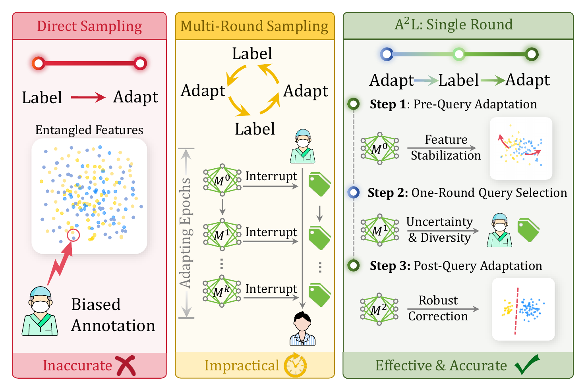
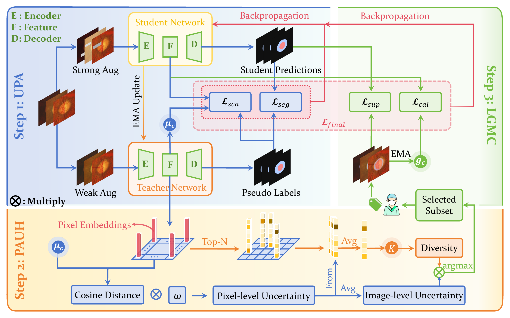

<h1 align="center">[A<sup>2</sup>L] Breaking Confirmation Bias: Single-Round Active Manifold Calibration for Source-Free Domain Adaptation in Segmentation</h1>

## 📌 Abstract

Source-free domain adaptation transfers a pretrained model to an unlabeled target domain without retaining the source data. In medical image segmentation, however, adaptation based on self-generated pseudo-labels can reinforce confirmation bias, while querying samples before adaptation may inherit the source model's domain bias. Conventional multi-round active learning further requires repeated annotation and training interruptions. We present A<sup>2</sup>L, a single-round active learning framework for source-free fundus image segmentation. A<sup>2</sup>L first performs pre-query adaptation with an exponential moving average teacher, weak-to-strong consistency, and prototype alignment. It then estimates prototype-aware pixel uncertainty, aggregates the hardest foreground pixels into image-level scores, and combines uncertainty with feature diversity to select the annotation set in one round. Finally, the selected masks provide golden class anchors for label-guided manifold calibration with class-adaptive margins. This repository implements A<sup>2</sup>L for optic cup and optic disc segmentation, including single-domain development protocols and compound/open-domain evaluation.

## 🎯 Motivation

<p align="center">
  
</p>

## 🎇 Method Overview

<p align="center">
  
</p>

A<sup>2</sup>L contains three consecutive stages:

1. **UPA:** adapts an EMA teacher-student model before annotation using pseudo-label supervision and class-prototype alignment.
2. **PAUH:** performs one-round prototype-aware querying by combining hard-pixel uncertainty with feature-space diversity.
3. **LGMC:** uses the selected ground-truth masks as golden class anchors to calibrate the target feature manifold.

## 💡 Key Features

- A single annotation round avoids repeatedly interrupting target-domain adaptation.
- Pre-query adaptation reduces the source model's domain bias before sample selection.
- Prototype-aware uncertainty focuses the query score on difficult optic cup and optic disc pixels, while diversity discourages redundant selections.
- Label-guided calibration injects reliable class anchors into post-query adaptation instead of treating all pseudo-labels as equally trustworthy.
- The implementation records configurations, data manifests, environment metadata, selection scores, checkpoints, and evaluation metrics for each run.

## 🚀 Installation & Usage

### 1. Environment

```bash
git clone https://github.com/JiaqiZhang-Sengoku/A2L.git
cd A2L

conda create -n a2l python=3.10 -y
conda activate a2l
```

Install PyTorch and torchvision for your CUDA version by following the [official PyTorch installation guide](https://pytorch.org/get-started/locally/), then install the remaining dependencies:

```bash
pip install numpy pillow opencv-python medpy scipy
```

### 2. Data Preparation

Arrange the target-domain fundus images and masks as follows:

```text
Data/
├── Domain1/
│   ├── train/ROIs/
│   │   ├── image/
│   │   └── mask/
│   └── test/ROIs/
│       ├── image/
│       └── mask/
├── Domain2/
│   ├── train/ROIs/
│   │   ├── image/
│   │   └── mask/
│   └── test/ROIs/
│       ├── image/
│       └── mask/
└── Domain4/
    └── test/ROIs/
        ├── image/
        └── mask/
```

Each image and its mask must have the same file name. The expected grayscale mask values are `255` for background, `128` for optic disc, and `0` for optic cup.

### 3. Source Checkpoint

A<sup>2</sup>L starts from a source-pretrained DeepLabV3 model with a MobileNet backbone. Place the source checkpoint at:

```text
Checkpoints/
└── Source/
    └── source_model.pth.tar
```

Alternative data, checkpoint, and output paths can be supplied through `--data-dir`, `--model-file`, and `--output-root`.

### 4. Development Runs

The Domain1 and Domain2 entry points use the fixed split in `Config/validation_split.json`. They hold out samples from the training set for validation and do not open test images or labels.

```bash
python A2L_Domain1.py
python A2L_Domain2.py
```

The default protocols use 30 epochs, 10 pre-query warm-up epochs, and one-round annotation budgets of 2 images for Domain1 and 5 images for Domain2.

Inspect the effective configuration without loading the training dependencies or data:

```bash
python A2L_Domain1.py --print-config
python A2L_Domain2.py --print-config
python A2L_Domain4.py --print-config
```

### 5. Compound and Open-Domain Evaluation

Domain4 jointly adapts on the Domain2 and Domain1 training sets with an annotation budget of 7 images. It evaluates the adapted model on Domain2 and Domain1 as the compound setting and on Domain4 as the open-domain setting.

```bash
python A2L_Domain4.py
```

Run all retained full-evaluation configurations, including Domain1, Domain2, and Domain4:

```bash
bash A2L_Test.sh
```

The full-evaluation script accesses the test sets. Use the single-domain entry points above for model development and validation.

## 📏 Metrics & Outputs

The implementation reports Dice and average symmetric surface distance (ASSD) for optic cup and optic disc segmentation.

Results are stored under a timestamped directory:

```text
Outputs/{dataset}/{timestamp}/
```

Depending on the selected protocol, a run can contain:

| Artifact | Description |
|---|---|
| `train.log` | Human-readable training and evaluation log |
| `config.json` | Effective run configuration |
| `run_metadata.json` | Protocol, checkpoint, and completion metadata |
| `dataset_manifest.json` | Exact samples used by the run |
| `environment.json` | Runtime and dependency information |
| `history.json` | Per-epoch optimization history |
| `selected_samples_a2l.txt` | Samples selected in the active-learning round |
| `selection_scores_a2l.csv` | Uncertainty and diversity selection scores |
| `selection_metadata.json` | Query-stage metadata |
| `after_adaptation_student.pth.tar` | Final student checkpoint |
| `after_adaptation_teacher.pth.tar` | Final EMA teacher checkpoint |
| `validation_history.json` / `.csv` | Development-set metrics across epochs |
| `best_adaptation_student.pth.tar` | Validation-selected student checkpoint |
| `metrics.json` / `.csv` | Full test metrics |
| `compound_eval_summary.csv` | Compound/open-domain summary for Domain4 |

## 📝 References

If you find the code useful for your research, please consider citing:


## 📢 LICENSE

The project is under [MIT License](./LICENSE), and is for research purpose ONLY.
